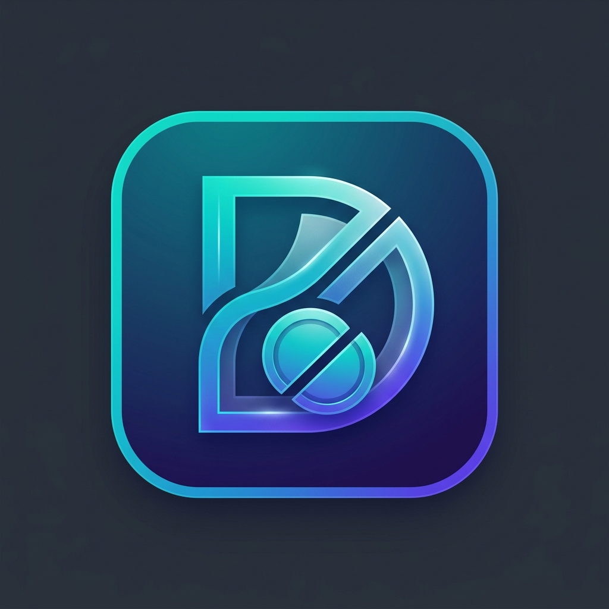

<div align="center">
  
  <h1>Dutch</h1>
  <p><strong>A modern expense sharing and bill splitting application.</strong></p>
</div>

## Overview
Dutch is a premium, intuitive expense tracking application designed to make splitting bills and managing shared expenses effortless. It features a responsive web interface and a seamless Tauri-based Android mobile application.

## Key Features
- **Effortless Expense Tracking:** Easily add and categorize your expenses.
- **Smart Splitting:** Go Dutch on group bills with intuitive split workflows.
- **Cross-Platform:** Available as both a modern Web Application and a Tauri Android App.
- **Beautiful UX/UI:** Enjoy a premium, fluid interface with a dedicated Wallet dashboard and smooth micro-animations.

## Getting Started

### Prerequisites
- Node.js & npm
- Angular CLI
- Rust & Tauri CLI (for Android build)

### Web Development Server
To start a local development server for the web app, run:
```bash
ng serve
```
Navigate to `http://localhost:4200/`. The application will automatically reload if you change any of the source files.

### Running on Android (Tauri)
To run the application on an Android device or emulator using Tauri:
```bash
npm run tauri android dev
```

## Tech Stack
- **Frontend:** Angular 18
- **Styling:** Vanilla CSS with Responsive Material aesthetics
- **Desktop/Mobile:** Tauri
